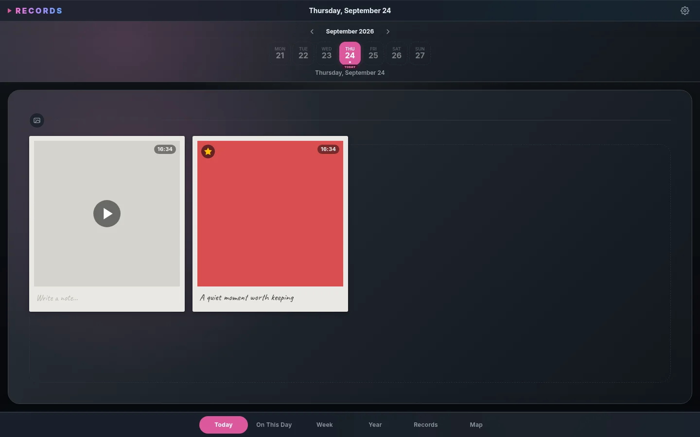

# Records for Omarchy

Records is a private, local-first photo and video diary. This repository
packages its SolidJS interface as an Omarchy shell plugin. The shell owns one
Node.js backend and opens the interface in an isolated Chromium app window.
The same frontend and backend are also packaged as a self-contained macOS
Electron application.



## Requirements

- Omarchy with plugin support
- Node.js 22 or newer at `/usr/bin/node`
- Chromium available as `chromium`
- Zenity for file and directory selection
- `gio` and Nautilus for opening attachment locations
- FFmpeg (including FFprobe) for video metadata, thumbnails, browser-compatible
  playback, and photo-to-GIF creation
- ImageMagick for image metadata, thumbnails, and safe caption writes
- ExifTool for reading and writing embedded captions and writing edited GPS
  coordinates back to image files

The installed plugin needs no npm installation. Node's built-in `node:sqlite`
provides a disposable, regenerable media index containing one `attachments`
projection table. It stores no authoritative metadata. Thumbnail and
streamable-video caches are keyed and revalidated from the physical source and
its current filesystem revision, never from disposable attachment row IDs.
Built frontend assets are committed under
`frontend/dist/`, and the small runtime dependencies are committed as generated
modules under `runtime/vendor/`.

## Install

### macOS

Records for macOS requires macOS 13 or newer. Releases provide separate native
artifacts named `Records-<version>-mac-arm64.dmg` for Apple silicon and
`Records-<version>-mac-x64.dmg` for Intel Macs, with equivalent ZIP archives.
Open the DMG and drag Records to Applications. The application bundles FFmpeg,
FFprobe, ImageMagick, Perl, and ExifTool; packaged production does not use
Homebrew, MacPorts, or media tools from `PATH`.

Each binary release also includes `Records-<version>-corresponding-source.tar.gz`
for the bundled GPL FFmpeg/x264 programs and replaceable LGPL libheif/libde265
libraries, plus a SHA-256 manifest. The source archive includes dav1d and the
complete rebuild, relocation, and replacement materials. These files are
published beside the DMG and ZIP, not embedded in the application.

Ordinary CI builds are intentionally unsigned. To test one, verify its checksum
and provenance first, move it to Applications, then remove quarantine locally:

```bash
xattr -dr com.apple.quarantine /Applications/Records.app
```

Do not bypass Gatekeeper for an artifact you do not trust. Tagged builds are
signed and notarized only when the repository's complete signing secret set is
available.

macOS configuration and durable application data live under
`~/Library/Application Support/records`; disposable indexes, thumbnails, and
map data live under `~/Library/Caches/records`. Profile-separated Electron
session data lives under
`~/Library/Application Support/records/electron/session`. Configured media
folders remain external and are never copied into any of these locations.

### Omarchy

Install the required host packages on Omarchy:

```bash
omarchy pkg add nodejs chromium zenity nautilus ffmpeg imagemagick perl-image-exiftool
```

Omarchy plugins cannot declare or automatically install system packages through
`manifest.json`. If the other host requirements are already installed, add only
the media tools with:

```bash
omarchy pkg add ffmpeg imagemagick perl-image-exiftool
```

`gio` is provided by GLib on Omarchy. `perl-image-exiftool` provides ExifTool;
it is separate from ImageMagick and is required for embedded photo captions and
GPS file writes. It can be omitted if those features are not needed. Restart
Records after installing host packages so the backend detects them.

Install and enable Records from GitHub:

```bash
omarchy plugin add https://github.com/zdehasek/records-desktop --enable
```

To install from a local checkout instead, run this from the repository root:

```bash
omarchy plugin add "file://$(pwd)" --enable
```

Omarchy clones the repository into
`~/.config/omarchy/plugins/io.github.zdehasek.records`. The local installation
therefore contains only files committed to the current branch; uncommitted
working-tree changes are not included. Build and verify the desired version,
then commit it before installing or updating it:

```bash
npm ci
npm run build
npm run check
```

No `sudo` or manual copying into `/usr/share/omarchy` is required.

Add `io.github.zdehasek.records` to the bar through Omarchy's bar settings.
The widget opens an **On This Day** preview. Its actions open the full centered
memory view or immediately play the curated memory story.

Inside Records, `Alt+5` opens On This Day. To make it available globally, add
this free Omarchy binding to `~/.config/hypr/bindings.lua`:

```lua
o.bind("SUPER + SHIFT + R", "Records: On This Day", "omarchy-shell records open on-this-day")
```

On This Day includes entries from the preceding eleven months and matching
dates in previous years. Generic native reminders are enabled by default at
09:00 local time on days that have memories; the time and enabled state are
available in Settings. Notification text never includes media details. Clicking
it opens On This Day and plays important/cover story items when available.

Records starts with a `production` profile. Create and switch profiles in
Settings; after switching, reopen Records through the normal panel. The active
profile name is stored at:

```text
${XDG_CONFIG_HOME:-$HOME/.config}/records/active-profile
```

Each profile keeps separate configuration, durable duplicate choices, browser
state, and disposable caches:

```text
${XDG_CONFIG_HOME:-$HOME/.config}/records/profiles/<profile>/config.yaml
${XDG_DATA_HOME:-$HOME/.local/share}/records/profiles/<profile>/
${XDG_CACHE_HOME:-$HOME/.cache}/records/profiles/<profile>/index.sqlite3
${XDG_CACHE_HOME:-$HOME/.cache}/records/profiles/<profile>/thumbnails/thumbnails.sqlite3
${XDG_CACHE_HOME:-$HOME/.cache}/records/profiles/<profile>/map-tiles.sqlite3
```

Add photo and video folders in onboarding or Settings. Every enabled folder is
scanned recursively in place and discovered files are never copied. Star one
folder as the default: photos, videos, and GIFs added through Records are written
under its `records/YYYY/MM/DD/` child. The first added folder is starred
automatically. Folders cannot overlap, and the default must be changed before it
can be paused or removed while alternatives remain.

Each isolated Chromium profile lives in its profile's Records data directory.
The backend listens only on `127.0.0.1` and uses an unguessable per-process URL prefix.
The data, cache, and profile directories are forced to mode `0700`; databases
and imported media are created with mode `0600`. Back up the Records
configuration directory, every configured media folder, and
each profile's durable `duplicates/` directory under the Records data home.
Video companions are included in their media roots. Do not back up the SQLite
indexes, generated thumbnails or streamable videos, map caches, or browser-only
filters and sidebar preferences. See the
[data storage table](doc/FILE_FORMATS.md#data-storage) for the complete boundary.
Creating a profile starts with no media folders. The user adds folders after
switching to it.

Map tiles and viewed map glyphs are cached for offline reuse.

## Privacy and Network Access

Media indexing, metadata, profiles, thumbnails, and edits remain on this
computer. Records makes network requests only for map features:

- Typing in map address search sends the typed query, IP address, and request
  timing to the public Photon service at `photon.komoot.io`.
- Opening or moving around a map downloads Protomaps PMTiles ranges and glyphs
  through the local Records backend. Protomaps receives the IP address, request
  timing, and requested map ranges or glyph names.
- Downloaded tiles and glyphs are cached locally. Previously viewed areas may
  work offline, but uncached maps and address search require a network
  connection.

Records does not upload media to these services. Avoid address search and map
views when no third-party network requests are desired.

## Update

Update the Git-managed plugin and restart the shell:

```bash
omarchy plugin update io.github.zdehasek.records --yes
omarchy restart shell
```

If Records was installed from a local checkout with `file://`, first build,
verify, and commit the changes in that checkout. Then update the installed app:

```bash
cd /path/to/records-desktop
npm run build
npm run check
git add <changed-files>
git commit -m "Describe the update"
omarchy plugin update io.github.zdehasek.records --yes
omarchy restart shell
```

The update command fetches the latest commit from the local checkout recorded
as the plugin's Git origin. It does not copy uncommitted working-tree changes.

Updates replace plugin code under `~/.config/omarchy/plugins/`; they do not
replace configuration or media. The SQLite cache has no migration history; an
incompatible cache is deleted and regenerated from authoritative files.
Configuration has one supported format, version 4. Before `1.0.0`, incompatible
configuration changes may require restoring or manually adapting
`config.yaml`; Records rejects unknown versions instead of rewriting them.
Back up the configuration and durable `duplicates/` data before updating. To
downgrade, restore those backups and install the earlier Git tag.

## Remove

### macOS

Quit Records, remove `Records.app`, and optionally delete the application-owned
data and caches:

```text
~/Library/Application Support/records/
~/Library/Caches/records/
```

The Application Support directory includes configuration, durable duplicate
choices, and profile-separated Electron browser state. The Caches directory is
regenerable. Back up any configuration and duplicate choices you want to keep.
Never delete a configured external media folder as part of uninstalling
Records.

### Omarchy

Disable and remove the plugin checkout without touching media or Records data:

```bash
omarchy plugin remove io.github.zdehasek.records
omarchy restart shell
```

Remove any optional Records binding from `~/.config/hypr/bindings.lua`. The
system packages listed under Requirements may be shared by other applications
and are intentionally not removed automatically.

The plugin removal command retains all configured media folders and these
Records-owned directories:

```text
${XDG_CONFIG_HOME:-$HOME/.config}/records/
${XDG_DATA_HOME:-$HOME/.local/share}/records/
${XDG_CACHE_HOME:-$HOME/.cache}/records/
```

After confirming that backups are usable, those three directories may be
deleted manually to purge settings, duplicate choices, Chromium profiles, and
regenerable caches. Never delete a configured external media folder as part of
uninstalling Records.

## File Authority

Records recursively indexes every enabled configured media folder. It
stores each root under a stable immutable name and caches root-relative paths.
Startup readiness is reported as soon as the local server is available. Initial
media-index reconstruction and photo-metadata reconciliation continue in the
background, with completed media projections becoming visible incrementally.

Only images and FFprobe-confirmed videos enter the projection. Every video
candidate must probe successfully and contain a video stream; silent videos and
videos with embedded audio are accepted, while standalone and containerized
audio-only files are ignored. Pre-existing journal and standalone-audio files
remain byte-for-byte untouched and outside the application model.

The scanner treats media files and video companions as authoritative. If photo
metadata extraction temporarily fails, it projects a filesystem fallback and
marks it for retry even while the source file remains unchanged; an existing
projection retains previously extracted intrinsic metadata until retry
succeeds. An enabled root that is temporarily offline keeps its projection.
Disabling or removing a root prunes only its disposable projection and
derivatives, never files in that root.

Photos keep their caption, important state, capture time, GPS coordinates,
make, and model in XMP/EXIF/IPTC metadata. Video files use an optional same-name
Markdown companion such as `clip.webm.md`; its YAML frontmatter stores date
override, important state, and color under `note_style.color`, while its body
stores the caption. Photo color uses XMP `PresentationColor` only as the
image-file encoding of that color. Video duration and stream types, including
an embedded audio stream when present, are reconstructed from the video itself.
See
[Durable File Formats](doc/FILE_FORMATS.md) for the public configuration,
visibility-path, video companion, photo metadata, and duplicate-choice formats.

Edits are rejected when source metadata cannot be written and verified. Photos
whose format or permissions prevent safe metadata writes remain view-only.
Attachment updates accept only `content`, `important`, `noteColor`, `createdAt`,
`Make`, `Model`, `latitude`, and `longitude`, with strict types and value
validation. Camera and GPS fields are image-only, and GPS coordinates must be
updated or cleared as a pair. Video updates use `noteColor`; there is no
`presentation_color` alias.
Deletion moves files to the desktop system Trash through `gio`. Records does
not provide an in-app Trash browser, restore action, or permanent-delete action.

Featured media in Today, Week, Year, memories, and stories is randomly chosen
from image or video messages marked important for that date. If a date has no
important media, it has no featured cover. Selecting two or more photos also enables
ordered GIF creation in the batch action bar; generated GIFs are written below
`records/` in the starred folder and indexed like ordinary media.

### Embedded captions

Instax captions are stored in the photo as XMP `dc:description`, with EXIF
`ImageDescription` and IPTC `Caption-Abstract` mirrors for compatible photo
tools. They are metadata, not text burned into the image pixels.

Caption saves never edit the sole original directly. Records writes a sibling
staging copy, reads the metadata back, verifies every decoded frame has the
same dimensions and pixel signature, and only then atomically replaces the
original. Unsupported, read-only, linked, changed, or unverifiable files fail
without changing the photo or its cached projection. JPEG, PNG, TIFF, and
WebP support depends on the installed ExifTool and ImageMagick versions;
HEIC/HEIF and AVIF support also depends on their installed delegates.

## Development

```bash
npm ci
npm run dev
```

`npm run dev` starts an isolated Node backend, a Vite frontend with Solid HMR,
and an isolated Chromium app window. Development data persists under `.dev/`
and never uses the installed database. Frontend JS, JSX, and CSS edits update
through HMR; edits under `runtime/` restart the backend automatically.

Use a fresh development database and profile when needed:

```bash
npm run dev:clean
```

Press Ctrl+C to stop Chromium, Vite, and the backend. To run Vite alone for
frontend troubleshooting, use `npm run dev:frontend`; RPC and media workflows
will not work without the full development runner.

Build and verify the installable plugin with:

```bash
npm run build
npm run check
npm run test:all
```

`npm run build` updates the committed bundle. `npm run build:omarchy` is the
explicit Omarchy build alias. `npm run check` verifies Prettier,
ESLint, unused imports, relative imports, Knip dead-code analysis, and Node tests.
`npm run test:all` requires runtime source-only coverage of 80% for statements,
lines, branches, and functions, with zero CRAP threshold failures.
Frontend source is guarded by complexity linting, Chromium browser tests, and a
committed-bundle freshness check; coverage and CRAP do not apply to it. The full
gate also validates the staged plugin and QML.
Additional diagnostics are available through:

```bash
npm run test:coverage
npm run report:crap
npm run report:css-candidates
```

The runtime-only CRAP report combines ESLint cyclomatic complexity with
native-test coverage.
The CSS report is intentionally heuristic and never fails the quality gate:
Solid `classList` expressions and composed selectors produce false positives.
Every candidate requires browser verification before deletion. Runtime code in
the installed plugin must remain self-contained. Run `npm run build` after
changing `yaml`, `chokidar`, or their runtime integration so `runtime/vendor/`
stays current. Never import QtWebEngine into the Omarchy shell; Chromium
isolation prevents renderer failures from crashing Quickshell.

On native macOS, `npm run vendor:build:mac` fetches checksum-locked official
sources and builds the media toolchain for the current architecture and macOS
13 deployment target. Then use `npm run build:mac` and either
`npm run dist:mac:arm64` or `npm run dist:mac:x64`. Native source and build
outputs are ignored; no generated vendor binary is committed.

For isolated backend testing, set all three XDG homes and use the profile
bootstrap:

```bash
XDG_CONFIG_HOME=/tmp/records-test/config \
XDG_DATA_HOME=/tmp/records-test/data \
XDG_CACHE_HOME=/tmp/records-test/cache \
node --no-warnings runtime/bootstrap.js
```

## Architecture

- `Service.qml` owns the singleton Node backend.
- `BarWidget.qml` and `Panel.qml` provide shell navigation.
- `runtime/bootstrap.js` selects the active profile before backend startup.
- `runtime/server.js` serves static assets, media, RPC, and push events.
- `runtime/rpc.js` allowlists repository operations.
- `runtime/watch-scanner.js` indexes configured photo and video roots.
- `frontend/src/` contains SolidJS source.
- `frontend/dist/` contains install-ready assets.

Records excludes cloud accounts, subscriptions, calendar synchronization,
mobile wrappers, and application-level auto-updating. Omarchy's plugin manager
handles plugin updates. The macOS edition uses Electron only as its native host.
Printing/PDF export and automatic
relocation of media imported by Records Desktop are not currently implemented.

## License

Records is MIT licensed. Bundled fonts and third-party code retain their own
licenses; see [Third-Party Notices](THIRD_PARTY_NOTICES.md). Map data is
copyright OpenStreetMap contributors and is displayed with attribution in the
map interface.
